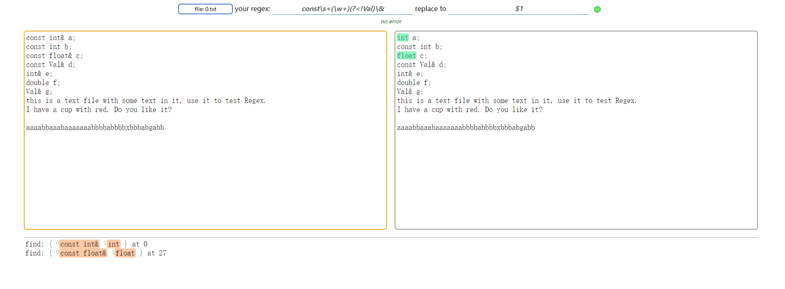

# regexr-lab
Test native RE libraries in many programming languages, including Python, Lua, C++, and JavaScript.

JavaScript RE lab: [https://luncybloont.github.io/regexr-lab/js.html](https://luncybloont.github.io/regexr-lab/js.html)

